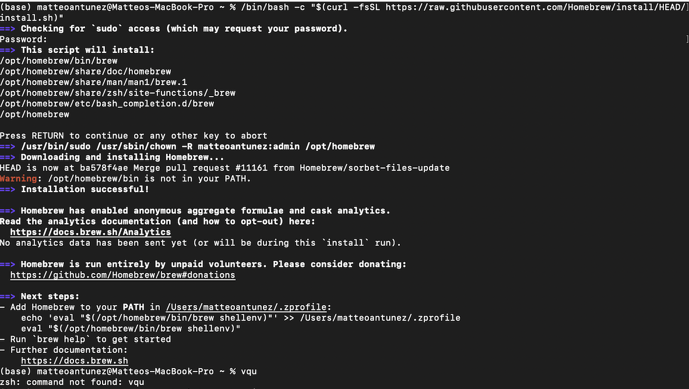
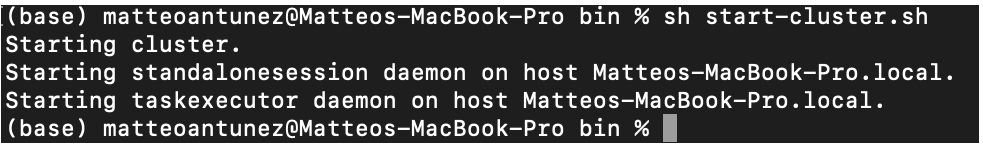

<!-- Note: This tutorial was based off the tutorial given by Apache Flink. Pleae visit the following URL for more information: http://bit.ly/flinkSetUp -->

# Apache Flink | Homebrew Installation (Local Setup)
<line>

Throughout the course, we experience the Windows side of Big Data Analysis and Development. Through careful reasearch and analysis, here is a brief tutorial on how to setup Flink (Homebrew is requried) onto your Mac machine.
 s
# Prerequisite
Prior to beginnnig the Flink installation, we must verify we have specific applications / services on our device.

1. Install Java if you have not already
    - Java is reuquired for this installation. If you are unsure if you have a valid Java version (1.8.0+ Version+), use the following command: ```  java -version ```.    
2. After Java has been verified, begin the installation for [Homebrew]("https://brew.sh"). You can find the detailed tutorial instructions [here]("https://brew.sh"). Below are some general instructions | tips:   
    
3. On your desktop, open Terminal. </li>

4.  Within Terminal, enter the following commnad in its current directory. 
    
    <code> $ brew install apache-flink </code>
        
5. (?) <strong>May Be Required:</strong> If you noticed that the installation prompts you to create a new <strong>PATH</strong>, run the two commands it prints out after the message. </li>
    <p> Once the installation has completed (a.k.a. returned to command line input), enter:<div style="color: orange; padding: .5em; font-size: 105%;"}>brew install wget</div> This will downloadv b vv bbbvb additioanl assets that weren't installed in the original installation. </p>    </ol> 

## Download and Install Apache-Flink
With Java and Homebrew installed locally on your Mac device, we can now procede to download and install Flink. To begin, use Homebrew to install Apache Flink.

```Terminal
$ brew install apache-flink
...
$ flink --version
Version: _._._, Commit Id: ______
```


## Start a Local Flink Cluster
Once we get Flink installed onto our device, we can then begin and run our first Flink Cluster. To begin, 

```Terminal
cd ../../opt/homebrew/Cellar/apache-flink/1.12.2/libexec/bin   # Navigate to the bin folder
sh start-cluster.sh # Call and open cluster file 
```




Once the cluster has been created, we should be able to go to http://localhost:8081 and see the Flink dashboard with oen available asset. 


As developers, we work in an enviroment where change is constant. For instance, ten years ago, we were using programming languages that could be discontinued or improved to other versions. However, all conding works together, so the intial 'on-boarding' by an employee will take less and less time.

For those who are curious, here is a short part of the SocketWindowWordCount fumction for you to analyze and make comments on!

<!-- Note: All code below was found directly from http://bit.ly/functionBoss -->

<details>
    <summary>Click to See Example!</summary>

```Java
    public class SocketWindowWordCount {

        public static void main(String[] args) throws Exception {

            // the port to connect to
            final int port;
            try {
                final ParameterTool params = ParameterTool.fromArgs(args);
                port = params.getInt("port");
            } catch (Exiception e) {
                System.err.println("No port specified. Please run 'SocketWindowWordCount --port <port>'");
                return;
            }

            // get the execution environment
            final StreamExecutionEnvironment env = StreamExecutionEnvironment.getExecutionEnvironment();

            // get input data by connecting to the socket
            DataStream<String> text = env.socketTextStream("localhost", port, "\n");

            // parse the data, group it, window it, and aggregate the counts
            DataStream<WordWithCount> windowCounts = text
                .flatMap(new FlatMapFunction<String, WordWithCount>() {
                    @Override
                    public void flatMap(String value, Collector<WordWithCount> out) {
                        for (String word : value.split("\\s")) {
                            out.collect(new WordWithCount(word, 1L));
                        }
                    }
                })
                .keyBy("word")
                .timeWindow(Time.seconds(5), Time.seconds(1))
                .reduce(new ReduceFunction<WordWithCount>() {
                    @Override
                    public WordWithCount reduce(WordWithCount a, WordWithCount b) {
                        return new WordWithCount(a.word, a.count + b.count);
                    }
                });

            // print the results with a single thread, rather than in parallel
            windowCounts.print().setParallelism(1);

            env.execute("Socket Window WordCount");
        }

        // Data type for words with count
        public static class WordWithCount {

            public String word;
            public long count;

            public WordWithCount() {}

            public WordWithCount(String word, long count) {
                this.word = word;
                this.count = count;
            }

            @Override
            public String toString() {
                return word + " : " + count;
            }
        }
    }
```
</details>
<br>

## Run The Example
So far, we have only done the Local Setup of Flink. To ensure we have everything working, we can try out the following Example!

### What's the Goal? 
For the example, we will be reading from a socket once every 5 seconds. Through each itteration, we will grab the number of occurences for each distinct word in the socket.

1. Start Local Server: ``` $ nc -l 9000 ```
2. Submit Flink Program: 
    ``` $ ./bin/flink run examples/streaming/SocketWindowWordCount.jar --port 9000 ```<br> Output: Starting execution of program for Chloee

With Flink working, we can now use the following command to processs and tumble through our materials in 5 seconds (more OR less).
    
Command File ⟶ ``` nc -l 9000 ``` 
* Used when typing in words

Done With Inputs, all or just one? Send the end results out $ tail ⟶ ``` cd log/flink-*-taskexecutor-*.out ```

* At the end of each time window, prints count <strong> if </strong> you aren't. 


## That's a Wrap!


To prevent this situation from happening to you, don't forget to <strong>*close*</strong> the file!

<code>
$ sh ./bin/stop-cluster.sh
</code>  